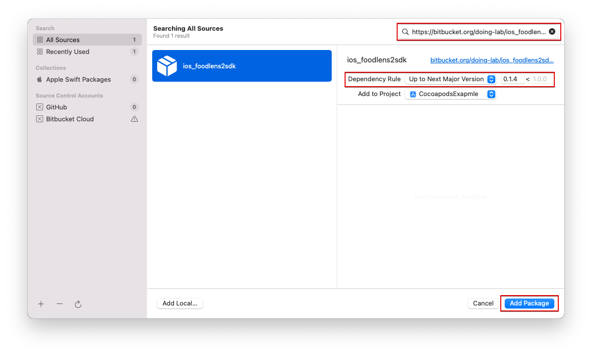

# iOS FoodLens SDK Manual

FoodLens functionality is available using the FoodLens SDK for iOS.

## Requirements

- iOS Ver 13.0 or higher
- Swift Version 4.2 or higher


## 1. iOS project setting

### 1.1 CocoaPods
Please add below line into your `Podfile`:  

```
pod 'FoodLens2'
```

If `pod install` is not searched for `Foodlens2`:

```
pod install --repo-update
```


### 1.2 Swift Package Manager(SPM)
Select `File` -> `AddPackage` or `ProjectSetting` -> `AddPackage`  
Search [https://bitbucket.org/doing-lab/ios_foodlens2sdk.git](https://bitbucket.org/doing-lab/ios_foodlens2sdk.git)





## 2. Resources and info.plist setting

### 2.1 AppToken, CompanyToken setting
FIXME setting on info.plist 

### 2.2 Permission Setting
Please add below lines on your info.plist
- Privacy - Camera Usage Description
- Privacy - Photo Library Additions Usage Description
- Privacy - Photo Library Usage Description


## 3. Set address of independent FoodLens2 server
If you want to use independent FoodLens2 server instead of FoodLens2 Server.
Please add below informaiotn on your info.plist
 
```swift
//Pelase add only domain name or ip address instead of URL e.g) www.foodlens.com, 123.222.100.10
```


## 4. How to use SDK
FoodLens API is working based on image which contaions foods.

### 4.1 Get prediction result
1. Create FoodlensService
2. Call predict method with image.

#### 4.1.1 Library import
```swift
import FoodLens2
```

#### 4.1.2 Create FoodLens2 service
```swift
// Please enter Company Token and App Token
FoodLens.createFoodLensService(companyToken: "<Company Token>", appToken: "<App Token>")
```

#### 4.1.3 Predict images
There are several ways to use FoodLens2. We provide three ways of concurrency.

※NOTE THAT, please use ORIGINAL IMAGE, if resolution of image is low, the recognition result can be impact.

##### 4.1.3.1 Closure
```swift
func predict(image: UIImage, complition: @escaping (Result<RecognitionResult, Error>) -> Void)
```

```swift
FoodLens.shared.predict(image: image) { result in
    switch result {
    case .success(let response):
        DispatchQueue.main.async {
            self.predictResponses = response
        }
    case .failure(let error):
        print(error.localizedDescription)
    }
}
```

##### 4.1.3.2 Combine
```swift
func predictPublisher(image: UIImage) -> AnyPublisher<RecognitionResult, Error>
```

```swift
FoodLens.shared.predictPublisher(image: image)
    .sink(receiveCompletion: { output in
        switch output {
        case .finished:
            print("Publisher finished")
        case .failure(let error):
            print(error.localizedDescription)
        }
    }, receiveValue: { response in
        DispatchQueue.main.async {
            self.predictResponses = response
        }
    })
    .store(in: &self.cancellable)
```

##### 4.1.3.2 async/await
```swift
func predict(image: UIImage) async -> Result<RecognitionResult, Error>
```

```swift
Task {
    let result = await FoodLens.shared.predict(image: image)
    switch result {
    case .success(let response):
        DispatchQueue.main.async {
            self.predictResponse = response
        }
    case .failure(let error):
        print(error.localizedDescription)
    }
}
```


### 4.2 FoodLens2 Options

#### 4.2.1 Auto image rotation based on Exif orientation information
```swift
//You can use image rotation based on Exit information, if you set true, food coordinate can be rotated based Exit information.
//Default value is true
FoodLens.setAutoRotate(true)
```


#### 4.2.2 Language setting
```swfit
//There are two options, English, Korea. Default is English
FoodLens.setLanguage(.en)      // English(default)
FoodLens.setLanguage(.ko)      // Korean
```


## 5. SDK detail specification
[API Documents](https://doinglab.github.io/foodlens2sdk/ios/index.html)

## 6. SDK Example
[Sample Code](https://github.com/doinglab/FoodLens2SDK/tree/main/IOS/SampleCode/)

## 7. JSON Format
[JSON Format](../JSON%20Format)

[JSON Sample](../JSON%20Sample)


## 8. License
FoodLens is available under the MIT license. See the LICENSE file for more info.
